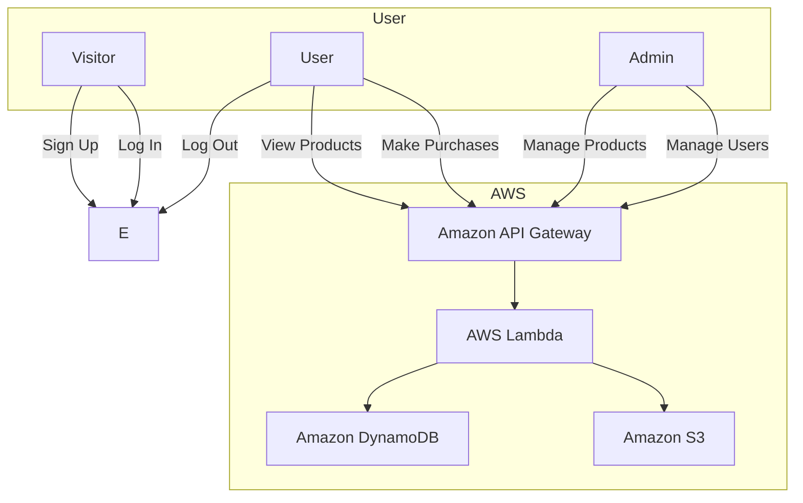

# Project Specification - Serverless Product Catalog & Inventory

For each project, be sure to include a clear readme, architecture diagrams, deployment instructions (e.g., SAM or CDK templates), and a demo video or screenshots if possible.

## Core Idea

Create a simple product catalog service, where you can add, edit, or remove products and track inventory in real time. The service should expose RESTful endpoints to manage products and inventory.

Key AWS Services

- AWS Lambda for the business logic (add product, remove product, update inventory).
-Amazon DynamoDB to store product details (name, price, stock).
- Amazon API Gateway to expose RESTful endpoints for CRUD operations.
- Amazon S3 (optional) to store product images.

Business Relevance

- E-commerce platforms need robust product management.
- Showcases how you can handle data persistence and secure API endpoints with minimal overhead.
- Demonstrates best practices for cost-effectiveness and scalability.

## User Personas

- **Visitor**: A persona who is not logged in. Can browse the product catalog but cannot make purchases or view user-specific information.
- **User**: A logged-in persona who can view and purchase products.
- **Admin**: A User with elevated permissions to manage products and users, including adding, updating, and removing products, as well as managing user roles.

## User Stories

### Epic: User Authentication

- As a Visitor, I can sign up for an account, so that I can access user-specific features.
- As a Visitor, I can log in to my account, so that I can access my personal information and make purchases.
- As a User, I can log out of my account, so that I can ensure my account is secure.

### Epic: Admin Features

- As an Admin, I can view all users in the system, so that I can manage user accounts effectively.
- As an Admin, I can remove a user from the system, so that I can maintain the integrity of the user base.
- As an Admin, I can update the role of a user, so that I can assign appropriate permissions.

### Epic: Product Management

- As an Admin, I can add a new product to the catalog, so that I can expand the product offerings.
- As an Admin, I can update a product definition, so that I can ensure the product information is accurate.
- As an Admin, I can update the inventory of a product, so that I can keep track of stock levels.
- As an Admin, I can remove a product from the catalog, so that I can manage the product offerings.

## Future Improvements

- Create another role for updating the stock of a product.
- Integrate a front-end (React or Vue) to display the product catalog.
- Add CloudFront for a global content delivery layer.

## Architecture Diagram

This diagram shows the high-level architecture of the product catalog service. The service is built using AWS Lambda, Amazon API Gateway, and Amazon DynamoDB. The service is secured using Amazon Cognito for user authentication.



## Project Structure

The project is organized into the following directories:

```
inventory-management-demo/
├── backend/
│   ├── src/
│   │   ├── functions/
│   │   │   ├── auth/
│   │   │   │   ├── handler.js
│   │   │   │   ├── index.js
│   │   │   ├── product/
│   │   │   │   ├── handler.js
│   │   │   │   ├── index.js
│   │   │   ├── user/
│   │   │   │   ├── handler.js
│   │   │   │   ├── index.js
│   │   ├── models/
│   │   │   ├── productModel.js
│   │   │   └── userModel.js
│   │   ├── services/
│   │   │   ├── authService.js
│   │   │   ├── productService.js
│   │   │   └── userService.js
│   │   ├── utils/
│   │   │   └── dbUtils.js
│   ├── tests/
│   │   ├── auth/
│   │   │   ├── handler.test.js
│   │   ├── product/
│   │   │   ├── handler.test.js
│   │   ├── user/
│   │   │   ├── handler.test.js
│   ├── package.json
│   └── serverless.yml
├── terraform/
│   ├── main.tf
│   ├── variables.tf
│   ├── outputs.tf
│   └── provider.tf
├── docs/
│   ├── PROJECT-SPEC.md
│   ├── API-DOCUMENTATION.md
│   └── ARCHITECTURE.md
└── README.md
```

## Finalizing the Project

- Deployment
- Github Actions